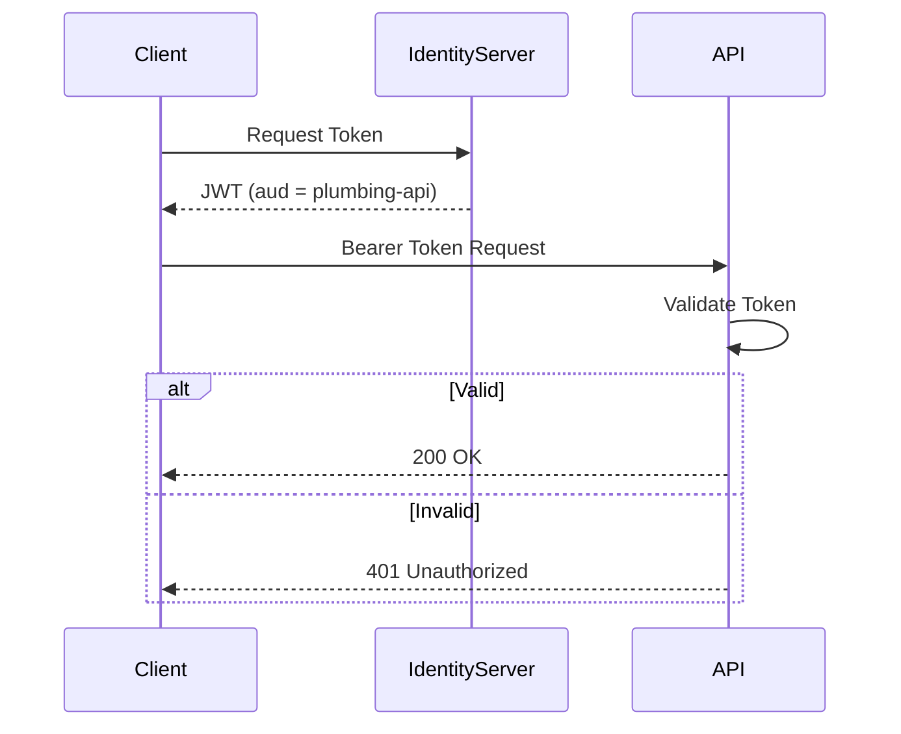
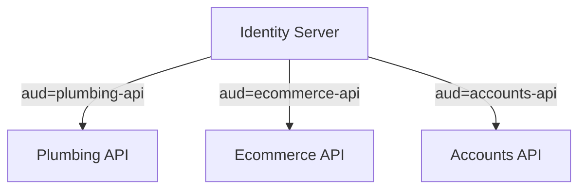
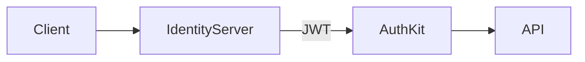

# Afrisys.JwtAuthKit

[](https://www.nuget.org/packages/Afrisys.JwtAuthKit)
[](https://www.nuget.org/packages/Afrisys.JwtAuthKit)
[](LICENSE)

---

## 🚀 Overview

**Afrisys.JwtAuthKit** is a lightweight, plug-and-play JWT authentication and authorization library for ASP.NET Core APIs.

It is designed for **secure microservice architectures**, enforcing strict API isolation using the **Audience (`aud`) claim**—ensuring each service only accepts tokens explicitly intended for it.

---

## 🎯 Why This Exists

Modern APIs often suffer from:

* Repeated JWT setup across multiple services
* Weak service-to-service security boundaries
* Overly complex authorization configurations
* Tight coupling to specific identity providers

**Afrisys.JwtAuthKit solves this by enforcing one simple rule:**

> 🔐 **The Audience (`aud`) defines API access boundaries**

---

## ✨ Features

* ⚡ One-line setup (`AddJwtAuthKit`)
* 🔐 Built-in validation (Issuer, Audience, Lifetime)
* 🧩 Works with any JWT provider (OpenIddict, Duende, Auth0, Azure AD, etc.)
* 🪶 Lightweight and dependency-safe
* 🏗️ Microservices-first design
* ✅ Works with Controllers and Minimal APIs

---

## 📦 Installation

```bash
dotnet add package Afrisys.JwtAuthentication.AspNetCore

```

---

## ⚙️ Configuration

### `appsettings.json`

```json
{
  "Auth": {
    "Authority": "http://your-identity-server.com",
    "Audience": "Your aud Here"
  }
}
```

### Configuration Reference

| Key         | Description                                                  |
| ----------- | ------------------------------------------------------------ |
| `Authority` | URL of the Identity Server issuing JWT tokens                |
| `Audience`  | The API identifier (must match the `aud` claim in the token) |

---

## 🧩 Setup

### `Program.cs`

```csharp
using Afrisys.JwtAuthKit;

var builder = WebApplication.CreateBuilder(args);

builder.Services.AddJwtAuthKit(builder.Configuration);

var app = builder.Build();

app.UseAuthentication();
app.UseAuthorization();

app.MapControllers();

app.Run();
```

---

## 🔐 Securing Endpoints

```csharp
using Microsoft.AspNetCore.Authorization;

[Authorize]
[ApiController]
[Route("api/[controller]")]
public class PlumbingController : ControllerBase
{
    [HttpGet]
    public IActionResult Get()
    {
        return Ok("Secure data");
    }
}
```

---

## 🔄 How It Works

1. A client requests a token from the Identity Server
2. The Identity Server issues a JWT containing an `aud` claim
3. The API validates:

   * Token signature
   * Issuer (`Authority`)
   * Audience (`aud`)
4. If validation fails → **401 Unauthorized**

---

## 🔐 Authentication Flow



---

## 🎯 Audience-Based Isolation



Each API only accepts tokens with its own audience.

---

## 🧪 Example Token Request

```bash
curl --location 'http://your-identity-server.com/connect/token' \
--header 'Content-Type: application/x-www-form-urlencoded' \
--data-urlencode 'client_id=plumbing-api' \
--data-urlencode 'client_secret=your-secret' \
--data-urlencode 'grant_type=client_credentials'
```

---

## ✅ Expected Token Payload

```json
{
  "iss": "http://your-identity-server.com",
  "aud": "plumbing-api",
  "exp": 1712345678,
  "client_id": "plumbing-api"
}
```

> ⚠️ **Important:** The `aud` claim is required. Without it, authentication will fail.

---

## ❗ Common Issues

### 🔴 Unable to validate audience

**Cause:**
Token does not contain `aud`

**Fix:**
Ensure your Identity Server sets:

```csharp
principal.SetAudiences("your-scope here");
```

---

### 🔴 401 Unauthorized

**Possible reasons:**

* Audience mismatch
* Token expired
* Invalid signature
* Wrong Authority URL

---

## 🧱 Architecture



---

## ⚙️ Requirements

* .NET 8 / .NET 10
* ASP.NET Core Web API
* Any JWT-compatible Identity Provider

---

## 📄 License

MIT License

---

## ❤️ Built For

Developers building **secure, scalable, and clean microservice architectures** with ASP.NET Core.
